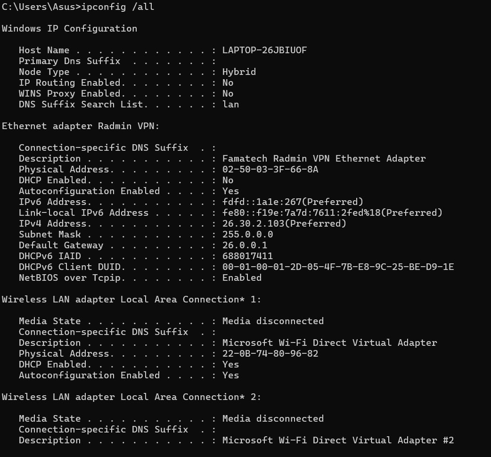
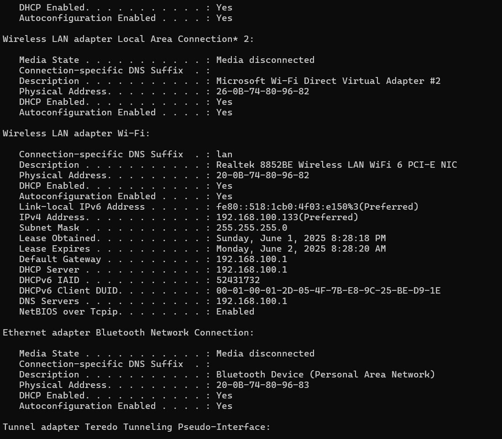
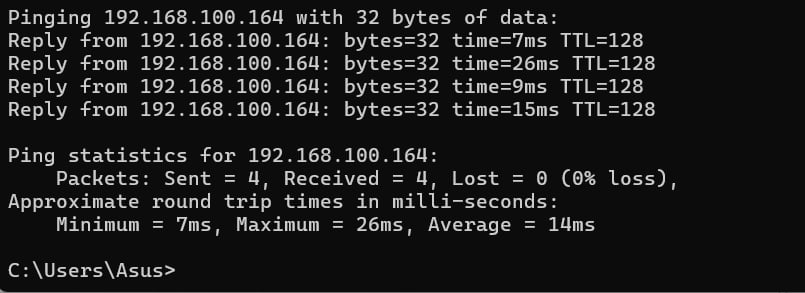
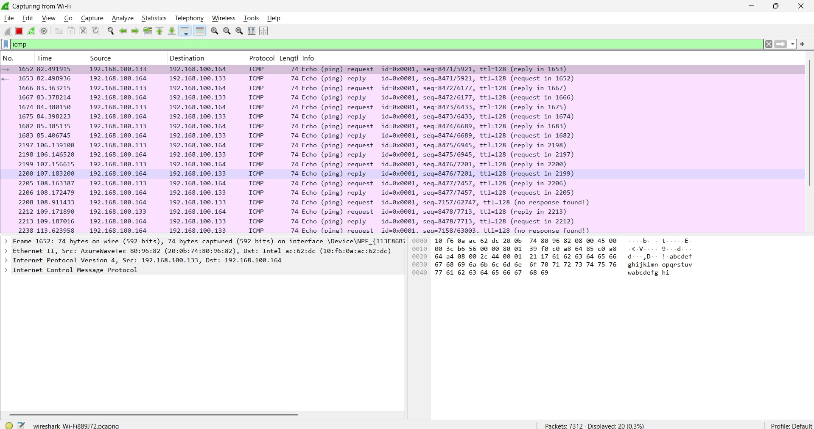
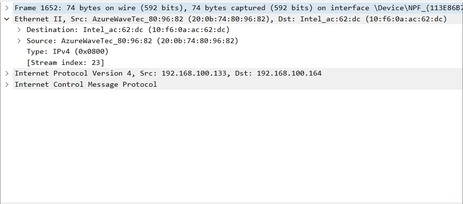
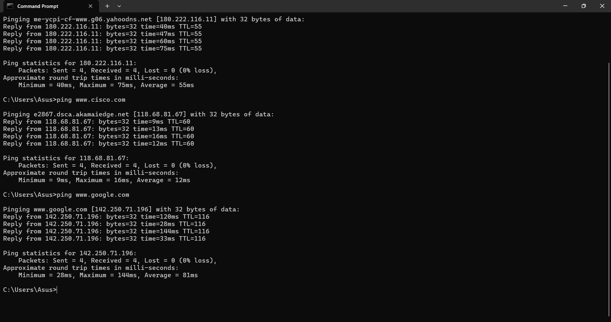
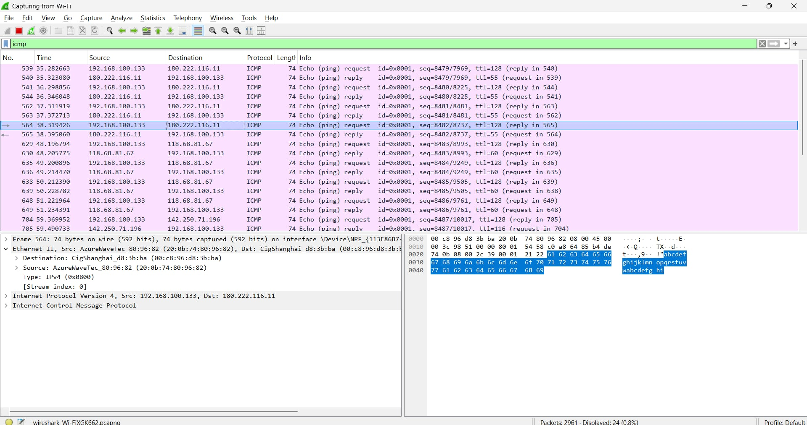
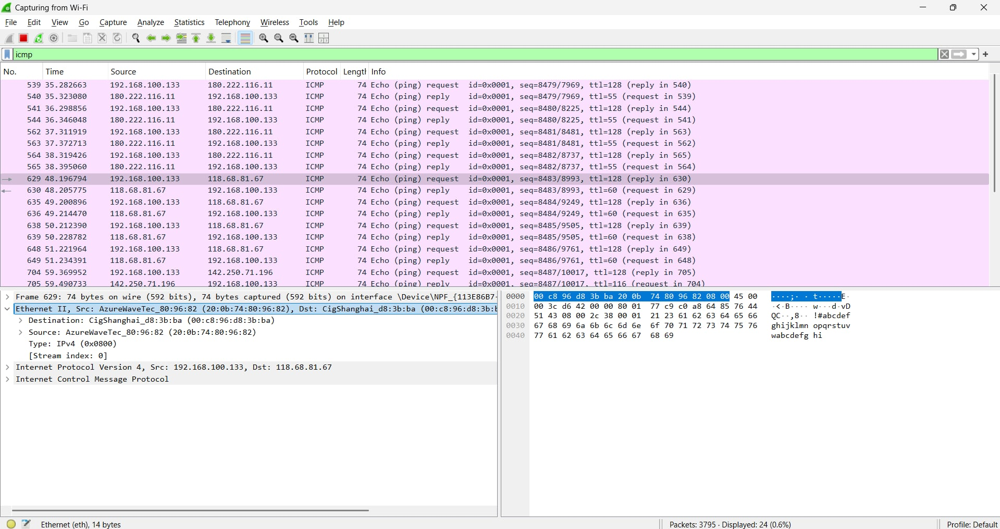
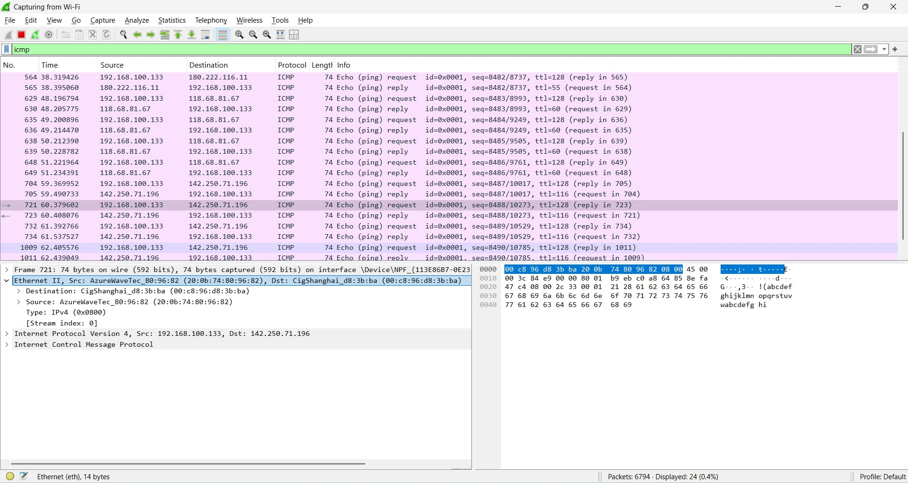

# Lab 3 - Use Wireshark to View Network Traffic
## Part 1: Capture and Analyze Local ICMP Data in Wireshark
### Step 1: Retrieve your PC interface addresses
1. In a command prompt window, enter **ipconfig /all**, to the IP address of your PC interface, its description,
and its MAC (physical) address.

2. Ask a team member or team members for their PC IP address and provide your PC IP address to them. Do not provide them with your MAC address at this time.
- Team Member :
  - IP Address: 192.168.100.164
  - MAC: 10-F6-0A-AC-62-DC
- My PC:
  - IP Address: 192.168.100.133
  - MAC: 20-0B-74-80-96-82
  - Subnet Mask: 255.255.255.0

### Step 2: Start Wireshark and begin capturing data
1. Navigate to Wireshark. Double-click the desired interface to start the packet capture. Make sure the
desired interface has traffic

2. Information will start scrolling down the top section in Wireshark. The data lines will appear in different
colors based on protocol. $\\$ 
This information can scroll by very quickly depending on what communication is taking place between
your PC and the LAN. We can apply a filter to make it easier to view and work with the data that is being
captured by Wireshark. 
For this lab, we are only interested in displaying ICMP (ping) PDUs. Type icmp in the Filter box at the top
of Wireshark and press Enter, or click the Apply button (arrow sign) to view only ICMP (ping) PDUs

3. This filter causes all data in the top window to disappear, but you are still capturing the traffic on the
interface. Navigate to a command prompt window and ping the IP address that you received from your
team member.

4. Stop capturing data by clicking the Stop Capture icon.

### Step 3: Examine the captured data
1. Click the first ICMP request PDU frames in the top section of Wireshark. Notice that the Source column
has your PC IP address, and the Destination column contains the IP address of the teammate PC that
you pinged.

2. With this PDU frame still selected in the top section, navigate to the middle section. Click the plus sign to
the left of the Ethernet II row to view the destination and source MAC addresses.

QUESTION: Does the source MAC address match your PC interface?
-> Yes, the source MAC address matches my PC interface (28-C5-D2-11-85-87).
QUESTION: Does the destination MAC address in Wireshark match your team member MAC address?
-> Yes, the destination MAC address in Wireshark matches my team member's MAC address (E6-B4-63-63-75-78).
QUESTION: How is the MAC address of the pinged PC obtained by your PC?
-> The MAC address of the pinged PC is obtained through the Address Resolution Protocol (ARP). When your PC sends an ICMP echo request to the pinged PC, it first checks its ARP cache for the corresponding MAC address. If it is not found, it sends an ARP request to the network to resolve the IP address to a MAC address, which is then used for communication.

## Part 2: Capture and Analyze Remote ICMP Data in Wireshark
### Step 1: Start capturing data on the interface.
1. Start the capture again
2. A window prompts you to save the previously captured data before starting another capture. It is not
necessary to save this data. Click Continue without Saving.
3. With the capture active, ping the following three website URLs from a Windows command prompt:
Open a Windows command prompt: www.yahoo.com, www.cisco.com, www.google.com

4. You can stop capturing data by clicking the Stop Capture icon.
### Step 2: Examining and analyzing the data from the remote hosts.
   - Yahoo: IP: 180.222.116.11 ; MAC: 00-C8-96-D8-3B-BA
   - Cisco: IP: 118.68.81.67 ; MAC: 00-C8-96-D8-3B-BA
   - Google: IP: 142.250.71.196 ; MAC: 00-C8-96-D8-3B-BA

QUESTION: What is significant about this information?
-> The significant information is that the MAC address of the remote hosts (Yahoo, Cisco, Google) is the same (4C-12-E8-14-87-10) but the IP addresses are different. 

QUESTION: How does this information differ from the local ping information you received in Part 1?
-> The local ping information in Part 1 showed unique MAC addresses for each PC on the local network, while the remote ping information in Part 2 shows that multiple remote hosts share the same MAC address.

REFLECTION QUESTION: Why does Wireshark show the actual MAC address of the local hosts, but not the actual MAC address for the
remote hosts?
-> For local hosts: Wireshark sees your PC's MAC address as the source and that local host's MAC address as the destination, because the packet is sent directly between the two computers within the same LAN.
-> For remote hosts: Wireshark only sees your PC's MAC address as the source and the MAC address of the default gateway as the destination. It cannot "see through" the router to view the actual MAC address of the remote host, because that MAC address is located on a different network segment, and Layer 2 information is changed at each hop across the router.