# Lab - Use Wireshark to Examine Ethernet Frames Topology   

## Part 1: Examine the Header Fields in an Ethernet II Frame

### Step 1: Review the Ethernet II header field descriptions and lengths

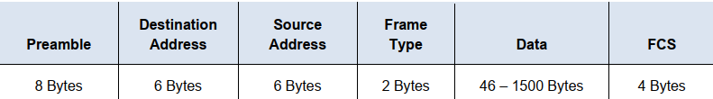

### Step 2: Examine the network configuration of the PC

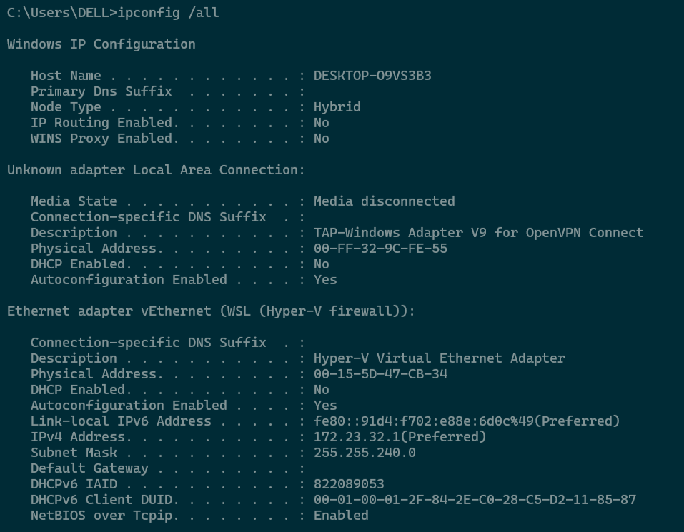
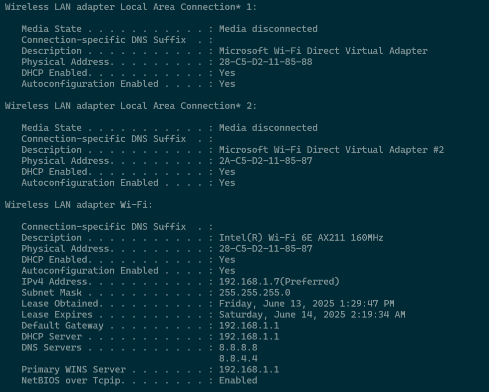

### Step 3: Examine Ethernet frames in a Wireshark capture
- ARP request

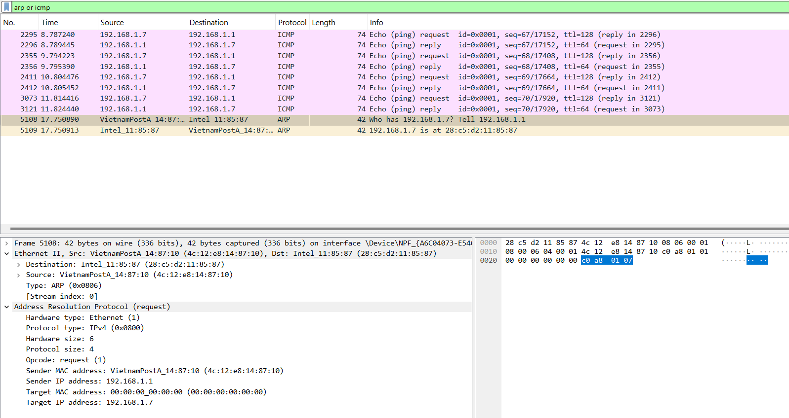
- ARP reply

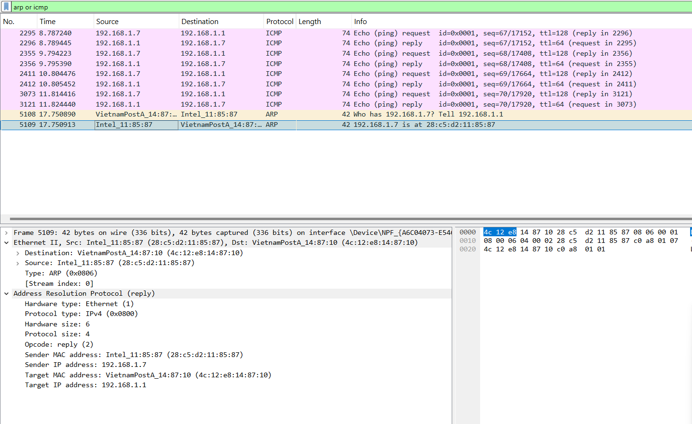

### Step 4: Examine the Ethernet II header contents of an ARP request
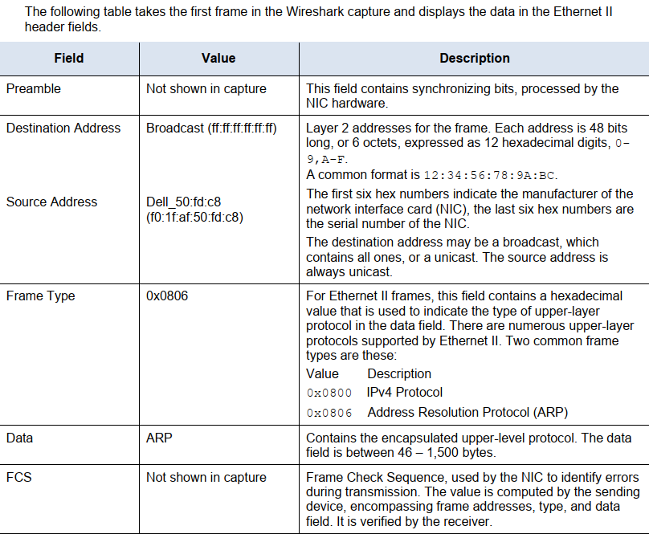

### Answer questions
**1. What is significant about the contents of the destination address field?**
- The significance of the contents of the destination address field is that it can be either a broadcast address or a unicast address. A broadcast address contains all bits set to 1 (ff:ff:ff:ff:ff:ff), which is used to send the frame to all devices on the network. A unicast address, on the other hand, targets a single device. This distinction is crucial for network communication because it determines whether the frame is being sent to all devices (broadcast) or just one specific device (unicast).

**2. Why does the PC send out a broadcast ARP prior to sending the first ping request?**
- The PC sends out a broadcast ARP (Address Resolution Protocol) request prior to sending the first ping request because it needs to determine the MAC (Media Access Control) address associated with the destination IP address. ARP is used to map an IP address to a MAC address in a local network.

**3. What is the MAC address of the source in the first frame?**
- 4c:12:e8:14:87:10

**4. What is the Vendor ID (OUI) of the Source NIC in the ARP reply?**
- Intel Corporate

**5. What portion of the MAC address is the OUI?**
- The first 3 octets of the MAC address indicate the OUI.

**6. What is the NIC serial number of the source?**
- 11:85:87

## Part 2: Use Wireshark to Capture and Analyze Ethernet Frames
### Step 1: Determine the IP address of the default gateway on your PC.
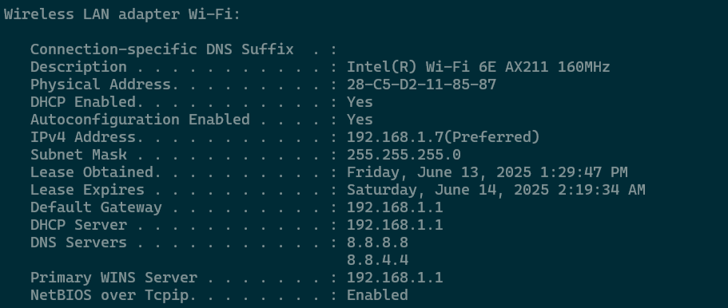

The IP address of the PC default gateway is 192.168.1.1

### Step 2: Start capturing traffic on your PC NIC
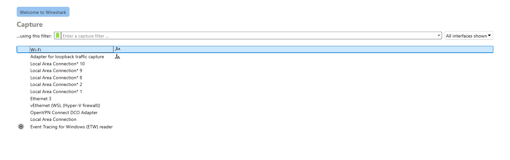

### Step 3: Filter Wireshark to display only ICMP traffic

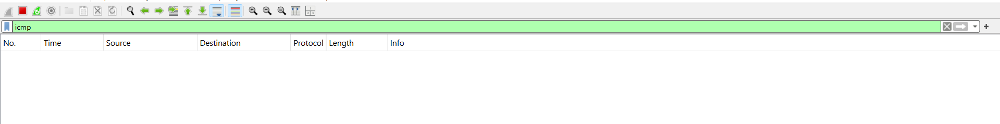

### Step 4: From the command prompt window, ping the default gateway of your PC

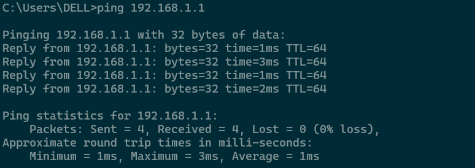

### Step 5: Stop capturing traffic on the NIC

### Step 6: Examine the first Echo (ping) request in Wireshark
a. In the packet list pane (top section), click the first frame listed. You should see Echo (ping) request
under the Info heading. The line should now be highlighted.

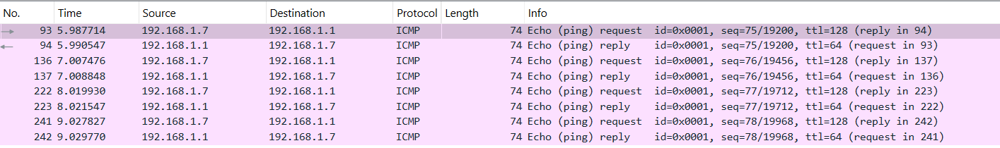

b. Examine the first line in the packet details pane (middle section). This line displays the length of the
frame

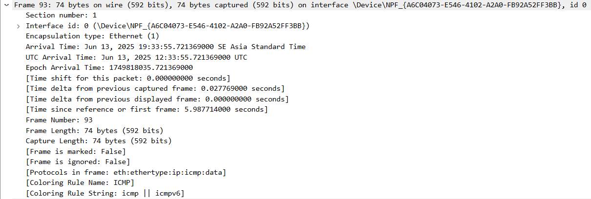

c. The second line in the packet details pane shows that it is an Ethernet II frame. The source and
destination MAC addresses are also displayed.

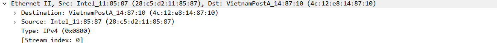

**What is the MAC address of the PC NIC?**
- 28:c5:d2:11:85:87

**What is the default gateway’s MAC address?**
- 4c:12:e8:14:87:10

d. You can click the greater than (>) sign at the beginning of the second line to obtain more information
about the Ethernet II frame.

**What type of frame is displayed?**
- IPv4 (0x0800)

e. The last two lines displayed in the middle section provide information about the data field of the frame.
Notice that the data contains the source and destination IPv4 address information.

**What is the source IP address?**
- 192.168.1.7

**What is the destination IP address?**
- 192.168.1.1

f. You can click any line in the middle section to highlight that part of the frame (hex and ASCII) in the
Packet Bytes pane (bottom section). Click the Internet Control Message Protocol line in the middle
section and examine what is highlighted in the Packet Bytes pane.

**What do the last two highlighted octets spell?**
- hi

g. Click the next frame in the top section and examine an Echo reply frame. Notice that the source and
destination MAC addresses have reversed, because this frame was sent from the default gateway router
as a reply to the first ping.

**What device and MAC address is displayed as the destination address?**
- Intel_11:85:87 (28:c5:d2:11:85:87)

### Step 7: Capture packets for a remote host

a. Click the Start Capture icon to start a new Wireshark capture. You will receive a popup window asking if
you would like to save the previous captured packets to a file before starting a new capture. Click
Continue without Saving

b. In a command prompt window, ping www.cisco.com.

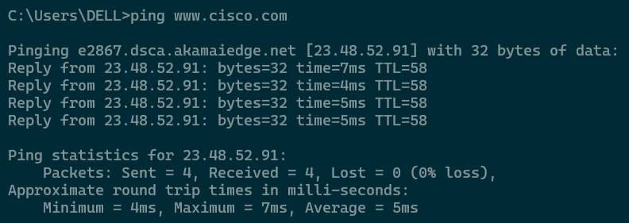

c. Stop capturing packets.
d. Examine the new data in the packet list pane of Wireshark.

**In the first echo (ping) request frame, what are the source and destination MAC addresses?**
- Source: 28:c5:d2:11:85:87
- Destination: 4c:12:e8:14:87:10

**What are the source and destination IP addresses contained in the data field of the frame?**
- Source: 192.168.1.7
- Destination: 23.48.52.91

**Compare these addresses to the addresses you received in Step 6. The only address that changed is the
destination IP address. Why has the destination IP address changed, while the destination MAC address
remained the same?**
- Layer 2 frames never leave the LAN. When a ping is issued to a
remote host, the source will use the default gateway MAC address
for the frame destination. The default gateway receives the packet, strips the Layer 2 frame information from the packet and then creates a new frame header with the MAC address of the next hop
- This process continues from router to router until the packet
reaches its destination IP address.

**Reflection Question**

**Wireshark does not display the preamble field of a frame header. What does the preamble contain?**
- The preamble field contains seven octets of alternating 1010 sequences, and one octet that signals the beginning of the frame, 10101011
