# Lab - View Network Device MAC Addresses  --- [file_pkt](lab7_2_7.pkt)
## Part 1: Configure Devices and Verify Connectivity
### Step 1: Cable the network as shown in the topology
a. Attack the devices shown in the topology and cable as necessary
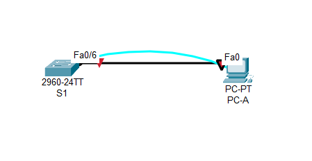

b. Power on all the devices in the topology.
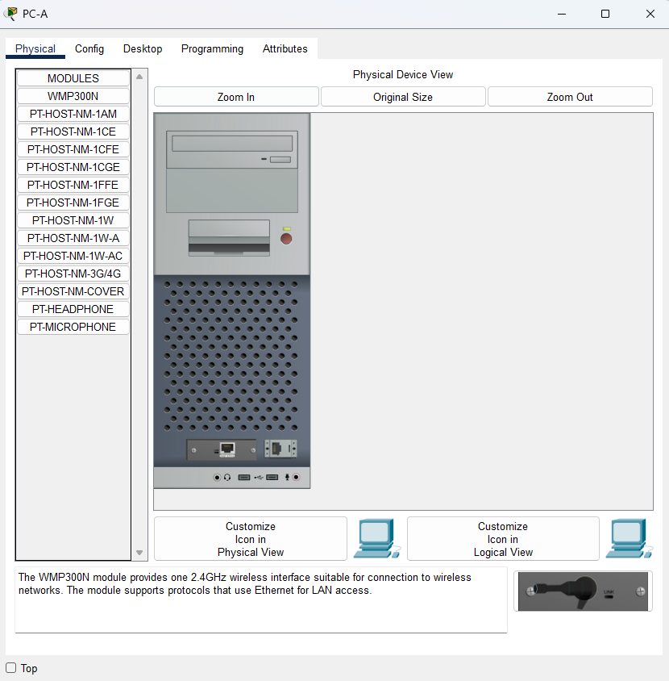

### Step 2: Configure the IPv4 address for the PC
a. Configure the IPv4 address, subnet mask, and default gateway address for PC-A.
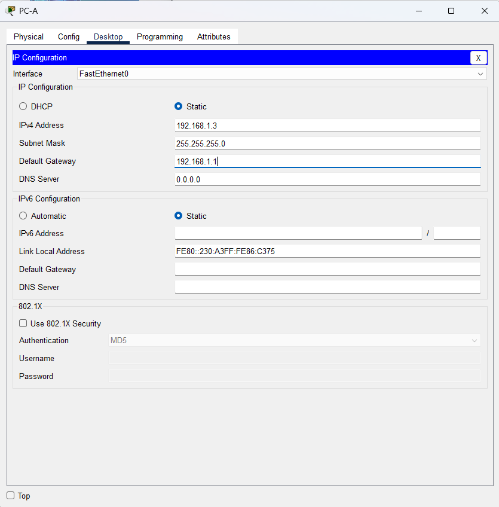

b. From the command prompt on PC-A, ping the switch address
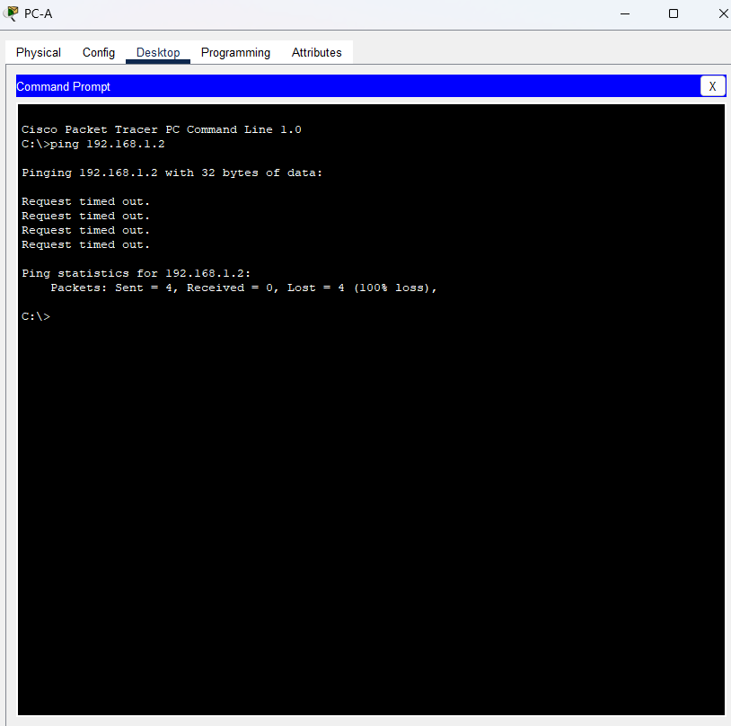

**Were the pings successful? Explain**
- No. The switch has not been configured yet.

### Step 3: Configure basic settings for the switch
a. Console into the switch and enter global configuration mode.
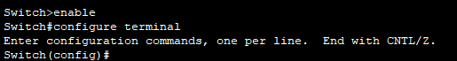

b. Assign a hostname to the switch based on the Addressing Table.


c. Disable DNS lookup.
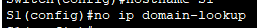

d. Configure and enable the SVI interface for VLAN 1.
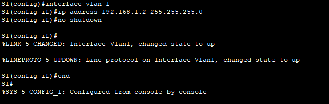

### Step 4: Verify network connectivity
Ping the switch from PC-A
**Were the pings successful?**
- The pings were successful.

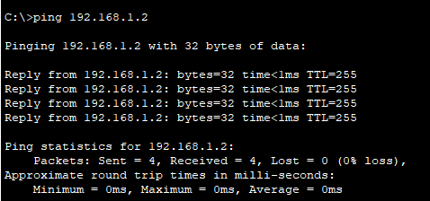

## Part 2: Display, Describe and Analyze Ethernet MAC Addresses
### Step 1: Analyze the MAC address for the PC-A NIC.
a. Using the output from the ipconfig /all command, answer the following questions.
```
C:\> ipconfig /all
<output omitted>
Ethernet adapter Ethernet:

   Connection-specific DNS Suffix  . :
   Description . . . . . . . . . . . : Intel(R) 82577LM Gigabit Network Connection
   Physical Address. . . . . . . . . : 5C-26-0A-24-2A-60
   DHCP Enabled. . . . . . . . . . . : Yes
   Autoconfiguration Enabled . . . . : Yes
   Link-local IPv6 Address . . . . . : fe80::b875:731b:3c7b:c0b1%10(Preferred)
   IPv4 Address. . . . . . . . . . . : 192.168.1.147(Preferred)
   Subnet Mask . . . . . . . . . . . : 255.255.255.0
   Lease Obtained. . . . . . . . . . : Friday, September 6, 2019 11:08:36 AM
   Lease Expires . . . . . . . . . . : Saturday, September 7, 2019 11:08:36 AM
   Default Gateway . . . . . . . . . : 192.168.1.1
<output omitted?
```

**What is the OUI portion of the MAC address for this device?**
- 5C-26-0A

**What is the serial number portion of the MAC address for this device?**
- 24-2A-60

**Using the example above, find the name of the vendor that manufactured this NIC.**
- Dell Inc

b. 
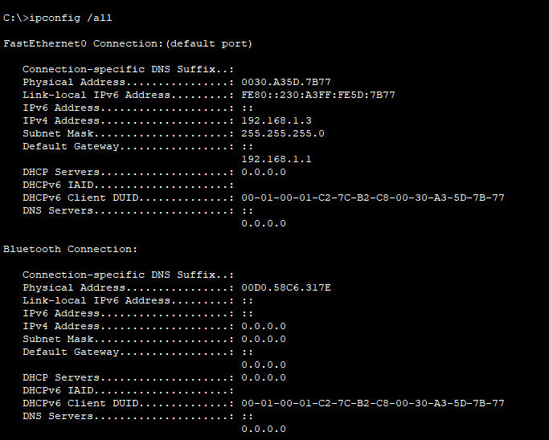

**From the command prompt on PC-A, issue the ipconfig /all command and identify the OUI portion of the MAC address for the NIC of PC-A.**
- 0030.A3

**Identify the serial number portion of the MAC address for the NIC of PC-A.**
- 5D.7B77

**Identify the name of the vendor that manufactured the NIC of PC-A.**
- Cisco Systems, Inc

### Step 2: Analyzed the MAC address for the S1 F0/6 interface.
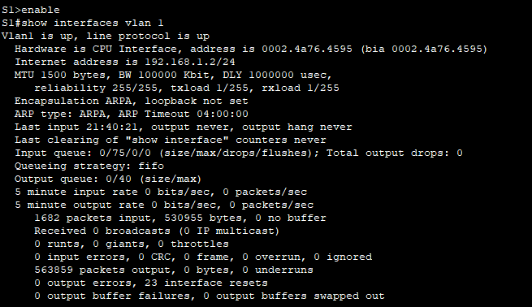

**What is the MAC address for VLAN 1 on S1?**
- 0002.4a76.4595

**What is the MAC serial number for VLAN 1?**
- 76-45-95

**What is the OUI for VLAN 1?**
- 00-02-4a

**Based on this OUI, what is the name of the vendor?**
- Cisco Systems

**Cisco Systems**
- Burned in address.

**Why does the output show the same MAC address twice?**
- The MAC address can be changed via a software command. The actual address (bia) will still be there. It is shown in the parenthesis.

b. Another way to display the MAC address on the switch is to use the show arp command. Use the show arp command to display MAC address information. This command maps the Layer 2 address to its corresponding Layer 3 address. A sample is shown below. Use output generated by your switch to answer the questions.
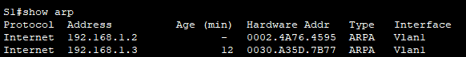

**What Layer 2 addresses are displayed on S1?**
- S1 VLAN 1 and PC-A MAC addresses. If the student also records the MAC addresses, their answers will vary.

**What Layer 3 addresses are displayed on S1?**
- S1 and PC-A IP addresses

### Step 3: View the MAC addresses on the switch
Issue the show mac address-table command on S1. A sample is shown below. Use output generated by your switch to answer the questions.

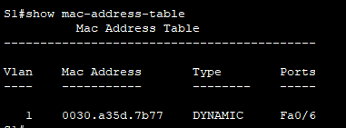

**Did the switch display the MAC address of PC-A? If you answered yes, what port was it on?**
- Yes. Port should be F0/6. Answers will vary for the MAC address. In the example above, the MAC address would be 0030.a35d.7b77

### Reflection Questions
**1. Can you have broadcasts at the Layer 2 level? If so, what would the MAC address be?**
- You can have broadcasts at Layer 2. ARP will use broadcasts to find MAC address information. The broadcast address is FF.FF.FF.FF.FF.FF.

**2. Why would you need to know the MAC address of a device?**
-  There could be a variety of reasons. In a large network, it may be easier to pinpoint location and identity of a device by its MAC address instead of its IP address. The MAC OUI will list the manufacturer, which may help narrow down the search. Security measures can be applied at Layer 2, so knowledge of allowable MAC addresses is needed.
