# Lab – View the Switch MAC Address Table       ------   [file.pkt](file_pkt.pkt)
## Part 1: Build and Configure the Network
### Step 1: Cable the network according to the topology.
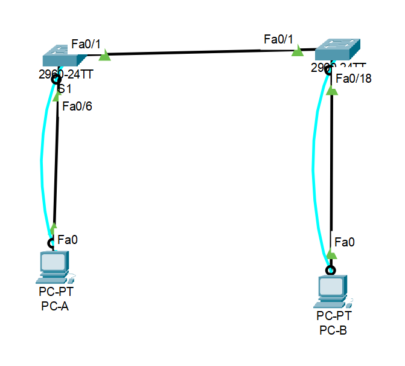

### Step 2: Configure PC hosts.
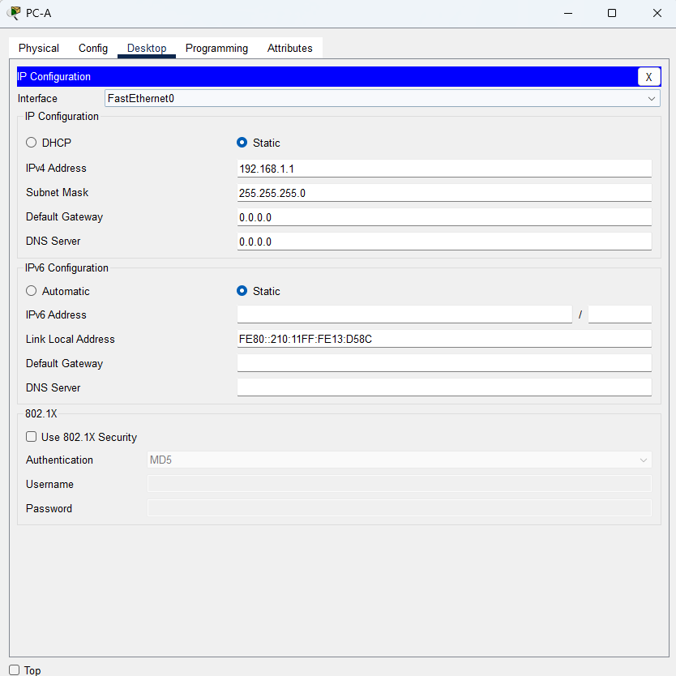
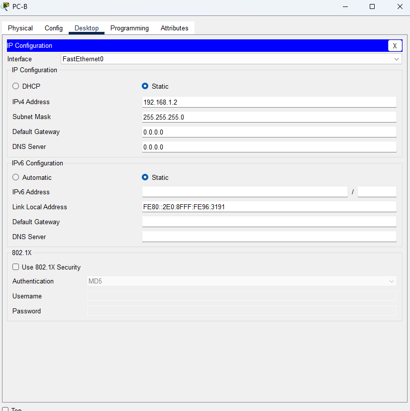

### Step 3: Initialize and reload switches as necessary.
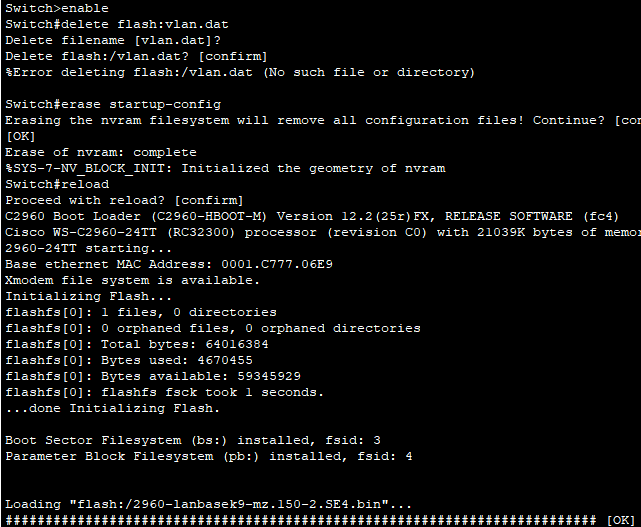
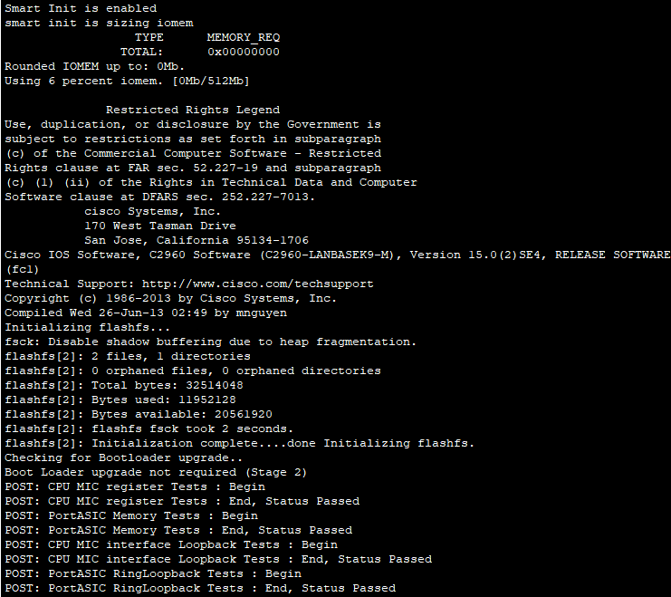
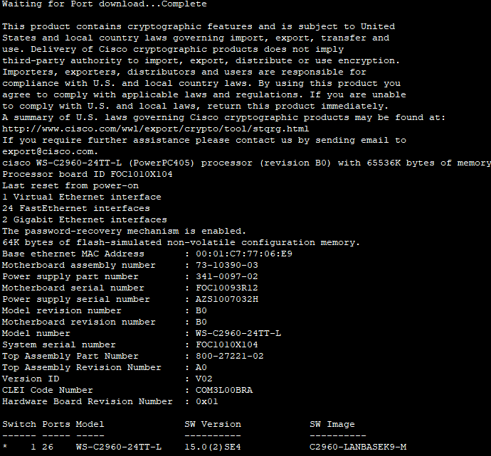
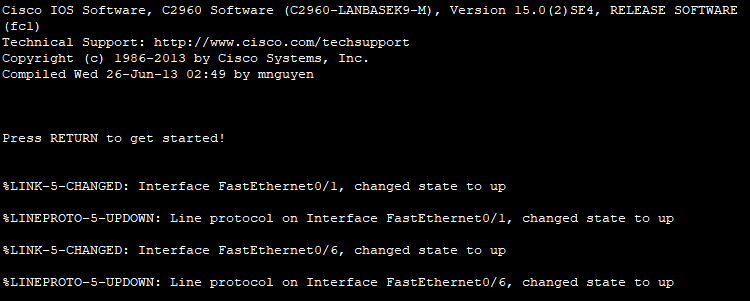

### Step 4: Configure basic settings for each switch.
a. Configure device name as shown in the topology.

b. Configure IP address as listed in Addressing Table.

c. Assign cisco as the console and vty passwords.

d. Assign class as the privileged EXEC password.

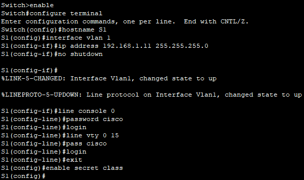
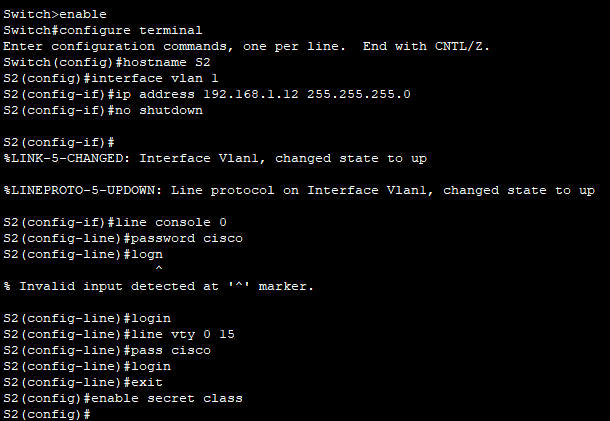

## Part 2: Examine the Switch MAC Address Table
### Step 1: Record network device MAC addresses.
a. Open a command prompt on PC-A and PC-B and type ipconfig /all.
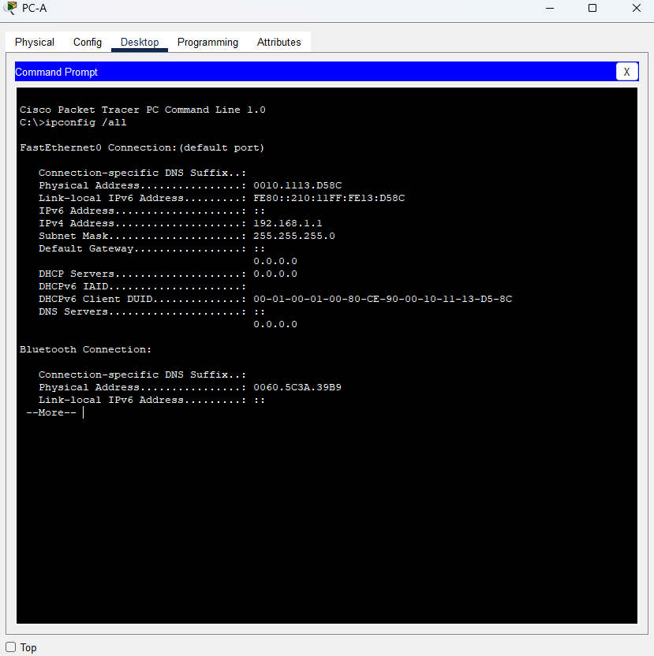
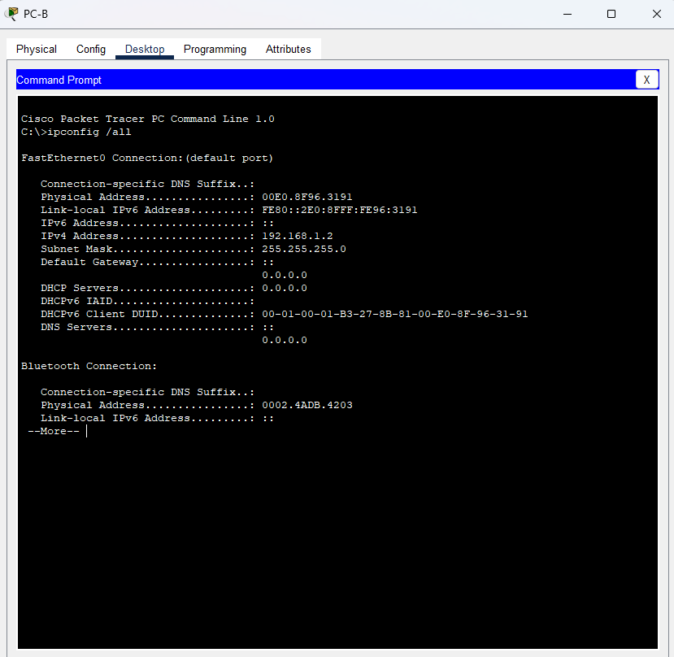

**What are the Ethernet adapter physical addresses?**
- PC-A: 0010.1113.D58C
- PC-B: 00E0.8F96.3191

b. Console into switch S1 and S2 and type the show interface F0/1 command on each switch.

**On the second line of command output, what is the hardware addresses (or burned-in address [bia])?**

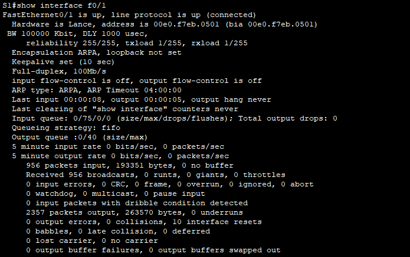
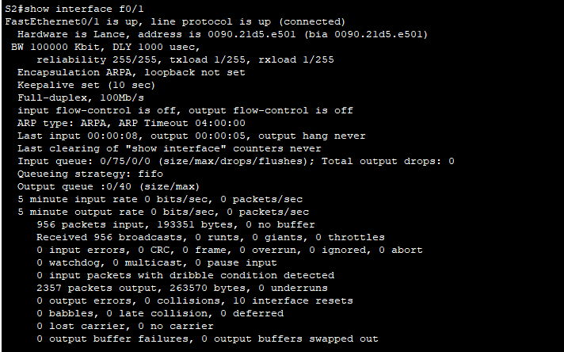

S1 Fast Ethernet 0/1 MAC Address:

- 00e0.f7eb.0501

S2 Fast Ethernet 0/1 MAC Address:

- 0090.21d5.e501

### Step 2: Display the switch MAC address table.
a. Establish a console connection to S2 and enter privileged EXEC mode.

b. In privileged EXEC mode, type the show mac address-table command and press Enter.

**Are there any MAC addresses recorded in the MAC address table?**
- The switch may have one or more MAC addresses in its table, based on whether or not the students entered a ping command when configuring the network. The switch will most likely have learned MAC addresses through S1’s F0/1 switch port. The switch will record multiple MAC addresses of hosts learned through the connection to the other switch on F0/1.

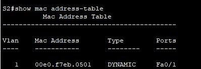

**What MAC addresses are recorded in the table? To which switch ports are they mapped and to which devices do they belong? Ignore MAC addresses that are mapped to the CPU.**
- There may be multiple MAC addresses recorded in the MAC address table, especially MAC addresses learned through S1’s F0/1 switch port. In the example output above, the S1 F0/1 MAC address and PC-A MAC address are mapped to S2 F0/1.

**If you had not previously recorded MAC addresses of network devices in Step 1, how could you tell which devices the MAC addresses belong to, using only the output from the show mac address-table command? Does it work in all scenarios?**
- The output of the show mac address-table command shows the port that the MAC address was learned on. In most cases this would identify which network device the MAC address belongs to, except in the case of multiple MAC addresses associated to the same port. This happens when switches are connected to other switches and record all of the MAC addresses for devices connected to the other switch.

### Step 3: Clear the S2 MAC address table and display the MAC address table again.

a. In privileged EXEC mode, type the clear mac address-table dynamic command and press Enter.

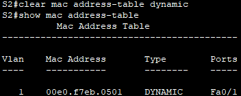

b. Quickly type the show mac address-table command again

**Does the MAC address table have any addresses in it for VLAN 1? Are there other MAC addresses listed?**
- No. The student will most likely discover that the MAC address for the other switch’s F0/1 switch port has been quickly reinserted in the MAC address table.

**Wait 10 seconds, type the show mac address-table command, and press Enter. Are there new addresses in the MAC address table?**
- Yes, there are.

### Step 4: From PC-B, ping the devices on the network and observe the switch MAC address table.

a. From PC-B, open a command prompt and type arp -a.

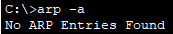

**Not including multicast or broadcast addresses, how many device IP-to-MAC address pairs have been learned by ARP?**
- Nothing

b. From the PC-B command prompt, ping PC-A, S1, and S2.

**Did all devices have successful replies? If not, check your cabling and IP configurations.**
- Yes

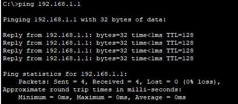
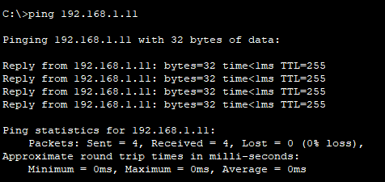
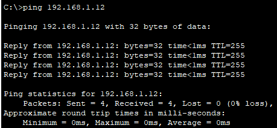

c. From a console connection to S2, enter the show mac address-table command. 

**Has the switch added additional MAC addresses to the MAC address table? If so, which addresses and devices?**
- There may only be one additional MAC address mapping added to the table, most likely the MAC address of PC-A.

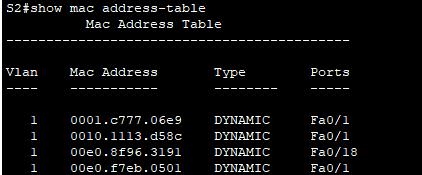

From PC-B, open a command prompt and retype arp -a.

**Does the PC-B ARP cache have additional entries for all network devices that were sent pings?**
- ARP cache on PC-B should have more entries.

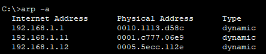

### Reflection Question
**On Ethernet networks, data is delivered to devices by their MAC addresses. For this to happen, switches and PCs dynamically build ARP caches and MAC address tables. With only a few computers on the network this process seems fairly easy. What might be some of the challenges on larger networks?**
- ARP broadcasts could cause broadcast storms. Because ARP and switch MAC tables do not authenticate or validate the IP addresses to MAC addresses it would be easy to spoof a device on the network.
